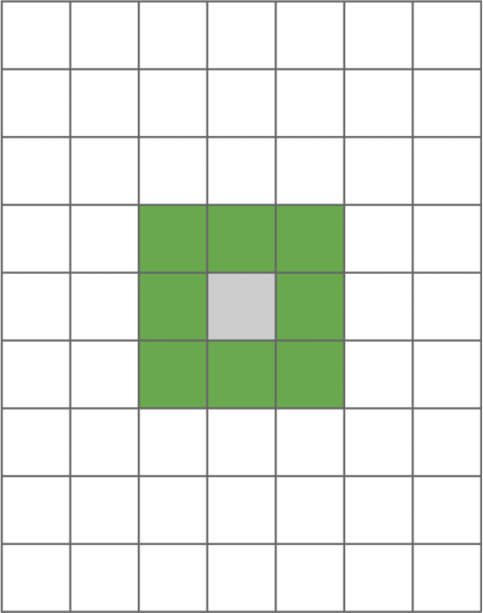
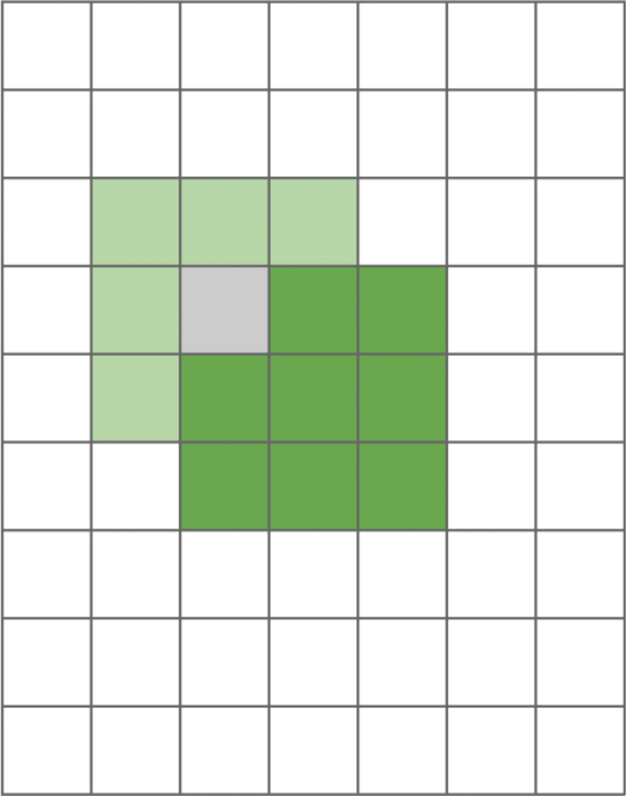
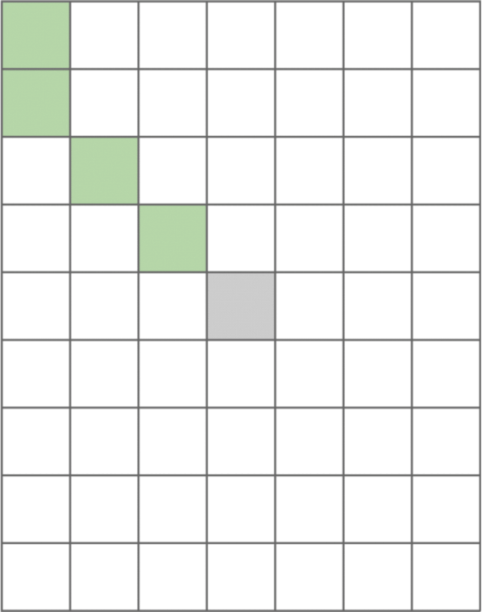
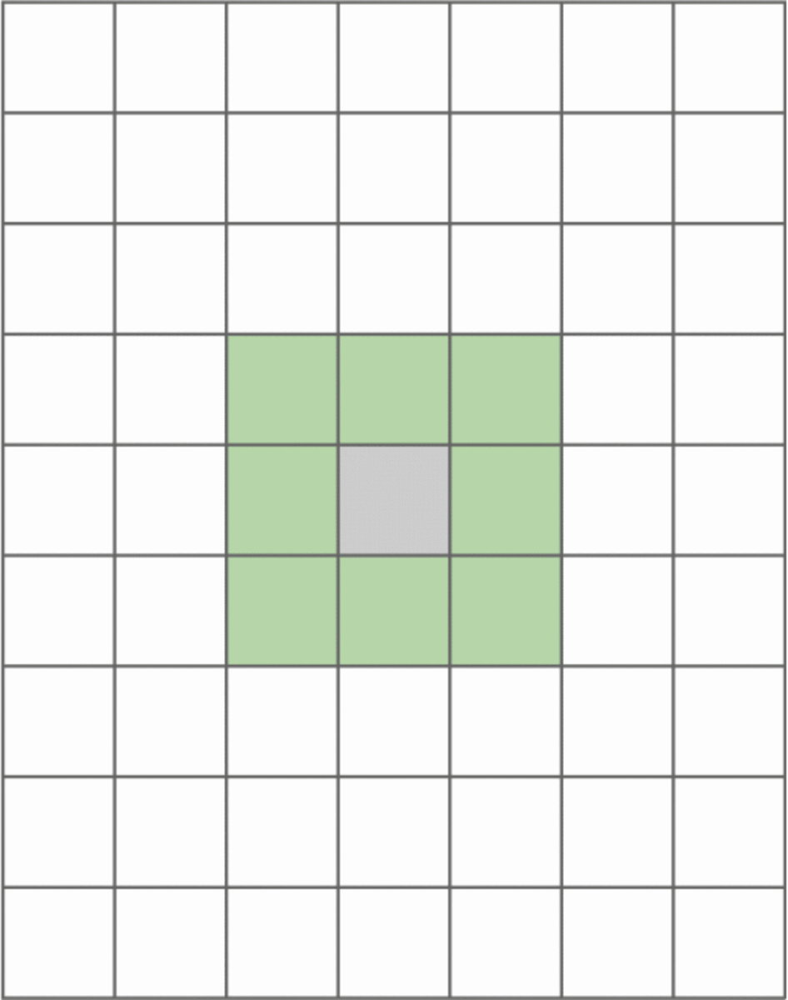

# Minesweeper - Web Based Implementation
### (Link Soon)

This repository includes the source code for a react-based implementation of the classic puzzle game, _minesweeper_, alongside a summary of performance comparison between depth-first search (DFS) and breadth-first search (BFS) in randomized simulated games.

For full performance comparison see __(Link Soon)__


## The Game

Minesweeper involves a grid of cells where some cells have hidden mines and others do not. The player's objective is to uncover all cells that are not hiding a mine. If the player uncovers a cell that is hiding a mine, the player loses. To assist the player in discovering the mineless cells, each uncovered cell shows the number of adjacent cells that are hiding mines. It will never be the case that the first cell a player selects is hiding a mine.

The player is able to flag cells that they believe to be hiding a mine (right click). Note however, that the number of flags placed on the board will not impact the game end conditions. All safe cells must be uncovered in order to achieve a successful outcome. Different modes of play offer different board dimensions and number of mines. This implementation includes the following minesweeper modes:

* Small - 8 x 12 with 8 mines
* Medium - 12 x 16 with 24 mines
* Large - 16 x 20 with 36 mines

This implementation of minesweeper also includes shortcut clicks. If an uncovered cell has an appropriate  number of flags on adjacent cells, the player can click the uncovered cell and all remaining adjacent unflagged cells will be uncovered automatically. For example, if an uncovered cell has one adjacent mine (uncovered cell labeled '1') and exactly one directly adjacent cell is flagged, the player can left click the uncovered cell and all remaining unflagged adjacent cells will be uncovered. 

(I play minesweeper far too much. As a result, I discovered that these shortcut clicks dramatically improve smoothness of the game.)


## The Cascades

If the player uncovers a cell which is not directly adjacent to any mines, all nearby cells will also be automatically uncovered. This is referred to as a __cascade__. 
          
In order to understand how cascades work, we need to define which cells qualify as _nearby_.

For the purposes of this description, we will refer to the originally selected cell as the __source__. All mines that are directly adjacent to the source, are considered to be _nearby_ and will be uncovered.



Adjacent cells are NOT the only cells which are uncovered during a cascade. Let's consider the case that one of these newly uncovered adjacent cells is similar to the source in that all of its directly adjacent neighbors are not mines. In this case, we can consider this cell to be a __new source__ cell. All of the cells directly adjacent to the new source cell are considered to be _nearby_ and will be uncovered.



From this point forward, our search for _nearby_ cells becomes rather repetitive. Each new cell that is uncovered becomes a new source if it satisfies the condition that none of its directly adjacent neighbors are mines.

So, let's recap. In the framing of a divide-and-conquer algorithm, we need to break our problem down into smaller tasks. The first small task is to check that a cell is not adjacent to any mines. If this condition is met, we need to traverse each of its directly adjacent neighbors and perform the same check for each of those cells. We can choose between two methods to perform this repetitive traversal.


## DFS

Our first option is __depth-first search__ (DFS). In DFS, we start at a source node and search as far down a single &apos;path&apos; as possible before backtracking. The first path is typically chosen based on how the structure is organized. In minesweeper, we may label all adjacent cells with indices and give preference to the lowest index. Thus, the first cell we visit is the cell which is one row up, and one column to the left.



The key data structure involved in DFS is the __stack__. The stack is a __last in, first out (LIFO)__ data structure, meaning that the most recent item added (pushed) to the data structure, will be the first item removed (popped) from the data structure. A stack can be thought of as a _stack_ of boxes where we can only add and remove boxes at the top of the stack. Thus, we can quickly grab the top box, but other boxes are not accessible.

So, in the case of minesweeper, in a DFS implementation each cell that should be uncovered will be added to the stack including the cell which was clicked. Now, the next cell to be uncovered will be the cell which was added to the stack most recently. We refer to this as the top of the stack. This continues until there are no more cells to add to the stack, and the stack has been emptied.

Now, in JavaScript/TypeScript, we can easily implement a stack using an array without the need for a class implementation. However, for the sake of demonstration, the following is a possible class implementation.

```
class Stack {
  s: Array<CellObj>;

  constructor(cell: CellObj) {
    this.s = [cell];
  }

  /* Assumes that queue has at least one member */
  pop(): CellObj {
    return this.s.pop()!;
  }

  push(cell: CellObj): void {
    this.s.push(cell);
  }

  size(): Number { return this.s.length };
}
```


## BFS

__Breadth-first search__ (BFS) is a traversal where we start at a source node and search all connected nodes in __layers__. The first layer is the set of nodes that are directly connected to the source, the second layer is the set of nodes that are directly connected to the first layer, and so on until we are out of connected nodes. In the context of minesweeper, cells are connected by adjacency. Using BFS, we first visit the cells that are directly adjacent to the source - the _first layer_. The _second layer_ would be all cells directly adjacent to the first layer, the _third layer_ would be all cells directly adjacent to the second layer, etc.



Similar to the use of a stack data structure in DFS, BFS relies on a __queue__ data structure. The queue is a __first in, first out (FIFO)__ data structure, which means that the earliest item which was pushed to the data structure is the first item to popped from the data structure. Now if a stack is analogous to a stack of boxes, a queue can be related to a _queue_ (or line) of people at a grocery shop. The first person to enter the queue will be the first person to be serviced by the cashier (assuming reasonable politeness). So, as more people enter the queue, they will have to wait for those ahead of them to be serviced first.

In the context of minesweeper, each cell which needs to be uncovered will be added to the queue. The cell at the front of the queue will be popped from the queue, uncovered, and then each of it's adjacent cells which should be uncovered are added back to the queue. The result is that the cells are uncovered in an order which is consistent with closeness to the source cell.

Unlike languages like C++, in JavaScript/TypeScript, there is no queue implementation included in the standard library. Therefore, it is necessary to implement one using a class.

```
class Queue {
  q: Array<CellObj>;
  head: number;

  constructor() {
    this.q = [];
    this.head = 0;
  }

  pop(): CellObj {
    const front: CellObj = this.q[this.head];
    delete this.q[this.head];
    this.head++;

    return front;
  }

  push(cell: CellObj): void {
    this.q.push(cell);
  }

  size(): Number { return (this.head - this.q.length) };
}
```
